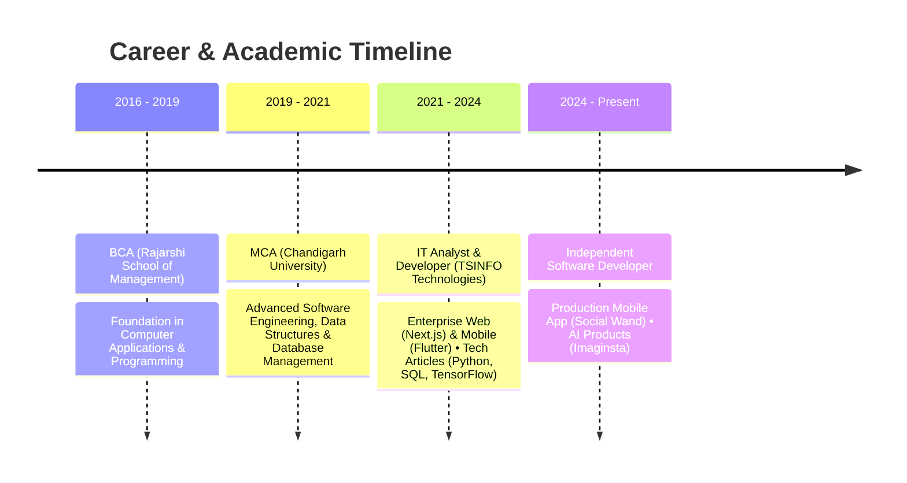

  
  <h1>Hi there, I'm Kumar Saurabh (Bobby) 👋</h1>
  
<strong>Software Developer | Full-Stack & Application Development</strong>

  
📍 India • Open to International Opportunities & Relocation

  

    
    
    
    
    
  

---

### 👨‍💻 Professional Summary

- 💼 **Experience:** **3+ years** of professional software engineering experience, spanning corporate enterprise application delivery as an **IT Analyst & Developer at TSINFO Technologies** and independent product engineering.
- 📱 **Mobile & Application Engineering:** Hands-on expertise building production-ready mobile apps for Android and cross-platform using **Flutter, Dart, Riverpod, and Drift (SQLite)**.
- 🌐 **Full-Stack & Web:** Crafting performant web applications using **Next.js, React, TypeScript, Node.js, and Tailwind CSS**.
- 🤖 **AI-Assisted & Modern Workflows:** Proficient in AI-powered feature integration (Firebase AI, AI SDKs, TensorFlow), rapid prototyping, and iterative development.
- 🎓 **Education:** Master of Computer Applications (**MCA**, Chandigarh University) & Bachelor of Computer Applications (**BCA**, Rajarshi School of Management).

---

### 🚀 Selected Projects

<table>
  <tr>
    <td width="50%">
      <h3 align="center">✨ Social Wand</h3>
      

        
      

      
<strong>AI-powered mobile application</strong> published on Google Play, designed to craft socially appropriate replies with AI assistance. Implements modern application architecture, secure authentication, real-time databases, and cloud AI services.

      
<code>Flutter</code> • <code>Riverpod</code> • <code>Firebase Auth</code> • <code>Cloud Firestore</code> • <code>Firebase AI</code>

    </td>
    <td width="50%">
      <h3 align="center">🎨 Imaginsta</h3>
      

        
      

      
<strong>AI digital product & creator platform</strong> integrating multimodal AI models for creative asset generation, image synthesis, and automated creator workflows.

      
<code>Next.js</code> • <code>TypeScript</code> • <code>Prisma</code> • <code>Turbopack</code> • <code>Vercel AI SDK</code>

    </td>
  </tr>
  <tr>
    <td colspan="2">
      <h3 align="center">🏢 Enterprise & Business Solutions</h3>
      
Contributed to production enterprise web and mobile applications at <strong>TSINFO Technologies</strong> (confidential web application & Android tools), along with custom workflow applications built for local retail and restaurants.

      
<code>Next.js</code> • <code>PostgreSQL</code> • <code>REST APIs</code> • <code>Flutter</code> • <code>Android</code> • <code>SQL Optimization</code>

    </td>
  </tr>
</table>

---

### 🛠️ Technical Skills

| Domain | Technologies & Tools |
| :--- | :--- |
| **Mobile Development** | Flutter, Dart, Android SDK, Riverpod, Drift (SQLite), Offline-first Architecture |
| **Frontend & Web** | Next.js, React, TypeScript, JavaScript, HTML5, CSS3, Tailwind CSS, NextUI |
| **Backend & Databases** | Node.js, PostgreSQL, SQL, MySQL, Firebase (Firestore, Auth, Cloud Functions) |
| **AI / Machine Learning** | TensorFlow, Firebase AI, Vercel AI SDK, AI-assisted development workflows |
| **Tools & Platforms** | Git, GitHub, VS Code, Android Studio, Vercel, RESTful APIs |

 

---

### 💼 Professional Journey

---

### 📜 Licenses & Certifications

| Certification | Issuing Organization | Issue Date | Credential ID / Verification |
| :--- | :--- | :--- | :--- |
| **Mastering Next.js 13 with TypeScript** | Code With Mosh | Oct 2023 | `cert_z61ytsbv` |
| **DeepLearning.AI TensorFlow Developer** | Coursera / DeepLearning.AI | Dec 2020 | [`T4RV6EJ6DPSL`](https://www.coursera.org/account/accomplishments/specialization/T4RV6EJ6DPSL) |
| **Complete Machine Learning & Data Science Bootcamp** | Udemy | Dec 2020 | [`UC-88ad5934...`](https://www.udemy.com/certificate/UC-88ad5934-cd75-4486-8621-b69ad9903e0a/) |
| **Computer Vision - Object Detection with OpenCV and Python** | Coursera | Sep 2020 | [`CQVMTMMVHGHN`](https://coursera.org/verify/CQVMTMMVHGHN) |
| **The Complete 2020 Flutter Development Bootcamp with Dart** | Udemy | Apr 2020 | [`UC-c5a6745a...`](https://www.udemy.com/certificate/UC-c5a6745a-2a97-4fe4-a763-72eadf051798/) |
| **Learn Java Programming** | Udemy | Apr 2020 | [`UC-636e6117...`](https://www.udemy.com/certificate/UC-636e6117-84a3-41d6-b74b-ce36bd6bd8e5/) |

---

### 📊 GitHub Activity & Statistics

  
  

  

---

  
🌐 Explore more projects and tutorials on <a href="https://dothecoding.com"><strong>dothecoding.com</strong></a>

  © Kumar Saurabh (Bobby) • Built with passion

